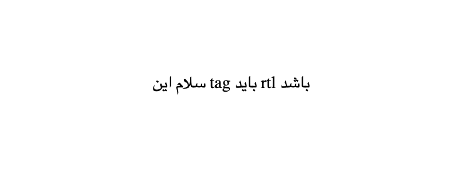
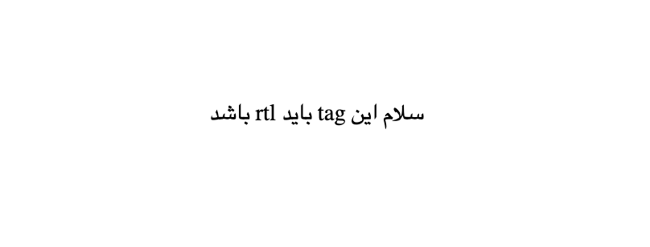

# RTLIT

> **ATTENTION!** Rtlit is in early stages and is under active development. It may have some unexpected bugs or may not work as expected on some websites. Please report them on [issues](https://github.com/mahdiAghaei1/rtlit/issues) page if you've seen any.

If you use a RightToLeft language, then you have seen what would happen if a website does not handle RTL text very well. You have probably seen such thing:

Using this browser extension could help you out to fix these type of texts.

## Installation

### Official releases

Download the official stable releases from:

- [Chrome Webstore](https://chromewebstore.google.com/u/2/detail/rtlit/jmaeeniakbbmmnncohddgdlnghffdgad)
- [Mozilla addons (Firefox)](https://addons.mozilla.org/en-US/firefox/addon/rtlit/)

### Manual (Other browsers)

**TIP:** I would suggest to download [the official releases](#official-releases). However, you can still install the extension manually.

You can go to [releases](https://www.github.com/mahdiAghaei1/rtlit/releases) tab to get the built extension or clone the project and follow the [development](#development) section to build the project first and then search for "how to install browser extension from source/zip on your favorite browser". Hopfully in the future we have official release for all major browsers. For example you can follow these instructions for chrome:

1. Keep the built project in a directory (somewhere you install your other softwares)
2. Go to `chrome://extension` on your browser
3. Turn on developer mode (if it's off)
4. Click on `Load unpacked` button
5. Choose to the build directory of the extension
6. Enjoy!

## Privacy

This extension does not collect any data, usage or history from your browser.

## Development

\<TBD\>

## Browser Support

Right now this extension just works on chrome and firefox browser, in the future we would probably support other browsers too.

## Contribution

I would appreciate it if you want to contribute to this project. Just open a pull request or an issue and we will discuss your changes there.

## Donation

This extension is free and I hope it helps you with your day-to-day experiance in different web pages. But I would appreciate your donations, Thank you all :white_heart:

- [Donation](https://daramet.com/mahdi_aghaei)
